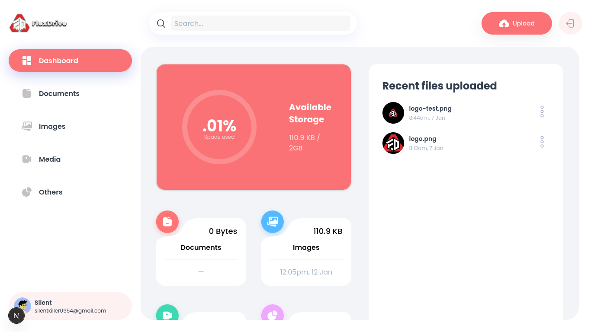

<h1>
  
   Flex Drive — Cloud File Storage Platform
</h1>


> **Flex Drive** is a modern **Google Drive–like cloud storage application** built with **Next.js App Router**, **Appwrite**, and **React 19**, enabling secure file uploads, previews, sharing, and management with a clean and responsive UI.

---

## ✨ Overview

**Flex Drive** allows users to:

- Upload and manage files securely
- Preview documents, images, videos, and media
- Organize files by type
- Share and download files
- Authenticate with secure sessions
- Visualize storage usage with charts

The application is designed as a **full-stack cloud storage solution** using **Appwrite as the backend-as-a-service**.

---

## 🖥️ Preview



---

## 📦 Tech Stack

### Frontend

- Next.js 16 (App Router)
- React 19
- TypeScript
- TailwindCSS 4
- Radix UI
- React Hook Form + Zod
- Recharts

### Backend / Services

- Appwrite (Auth, Database, Storage)
- Node Appwrite SDK

### Developer Tools

- ESLint 9
- Prettier
- Tailwind Merge
- PostCSS

---

## 📁 Folder Structure

```bash
.
├── app
│   ├── (auth)
│   ├── (root)
│   ├── globals.css
│   └── layout.tsx
├── assets
│   ├── icons
│   └── images
├── components
│   ├── ui
│   └── shared components
├── constants
├── hooks
├── lib
│   ├── actions
│   ├── appwrite
│   └── utils.ts
├── public
├── screenshots
├── types
├── package.json
└── README.md
```

---

## ⚙️ Environment Variables

Create a `.env` file in the root directory:

```env
NEXT_PUBLIC_APPWRITE_ENDPOINT="your_appwrite_endpoint_url"
NEXT_PUBLIC_APPWRITE_PROJECT="your_appwrite_project_key"
NEXT_PUBLIC_APPWRITE_DATABASE="your_appwrite_database_key"
NEXT_PUBLIC_APPWRITE_BUCKET="your_appwrite_bucket_field_key"
NEXT_APPWRITE_KEY="your_appwrite_secret_key"
```

---

## 🛠️ Getting Started

### Clone the Repository

```bash
git clone https://github.com/grep-many/flex-drive.git
cd flex-drive
```

### Install Dependencies

```bash
npm install
```

### Run Development Server

```bash
npm run dev
```

Open `http://localhost:3000/flex-drive` in your browser.

---

## 🚀 Features

- Secure authentication (Sign In / Sign Up)
- File upload with drag-and-drop
- File preview (images, videos, documents)
- File categorization by type
- File sharing and downloading
- Storage usage analytics
- Responsive dashboard layout
- Dark / Light theme support
- Clean and scalable architecture

---

## 🔧 Appwrite Configuration

Ensure the following are created in Appwrite:

- Project
- Database
- Storage Bucket
- Required permissions for users
- API key with server access

Appwrite configuration is handled in:

```ts
lib / appwrite / config.ts;
```

---

## 📌 Use Case

Flex Drive can be used as:

- A personal cloud storage system
- A portfolio-grade full-stack project
- A base for enterprise document management systems

---

## 🪪 License

This project is licensed under the **MIT License**. See the [](./LICENSE) for details.
